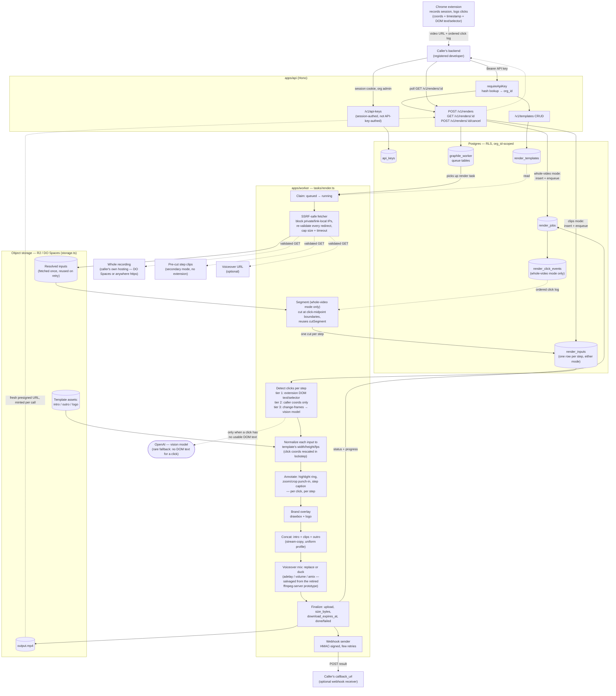

# CourseCut Render API — R&D Plan

## 0. Scope

A new public, programmatic API — separate from the org-member web UI — that lets a registered developer submit a set of video clips (or one whole video), each identified by a URL, and get back a single merged MP4: their clips assembled in order, wrapped in their org's intro/outro, carrying their brand colors, with an optional voiceover track. The response is a hosted URL to the finished file, with progress reported in between.

**The driving use case is product walkthrough videos, recorded by a Chrome extension.** The extension records one continuous screen capture of a workflow, uploads the whole video to the caller's own storage, and — because it can also read the DOM — logs every click as it happens: coordinates, timestamp, and the clicked element's text/selector/tag ("clicked the button labeled 'Save'"). The caller's request to this API is that one video URL plus that ordered click log. Nothing is pre-cut, nothing is pre-captioned by hand — the API segments the recording at the clicks, and because the extension already knows *what* was clicked, most captions are exact rather than guessed. A secondary mode still accepts pre-cut clips for callers without that kind of recorder (§2.3). See "Click detection & step annotation" for the full detail on both modes.

This is **not** the lesson-extraction product (upload → transcribe → AI-split into lessons → export). It shares no domain concept with `videos`/`lessons`/`transcript_segments`. What it shares is infrastructure: the same Postgres, the same `graphile-worker` queue, the same object store, the same `ffmpeg` wrapper module — because `apps/api` and `apps/worker` already are a general-purpose "queue a job, encode with ffmpeg, land the output in object storage" system, and this is a second job kind for it, not a second system.

Video for this feature reaches OpenAI **only conditionally, and only as still frames.** When a caller supplies click coordinates directly (the primary path — see below), nothing leaves for OpenAI at all. When they don't, a handful of extracted still frames per clip go to a vision model to locate the click — never the GIF itself, never audio. That's a narrower version of the same rule `coursecut-privacy-invariants` states for the lesson product (least data that leaves, and only ever to the one vendor), not an exception to it. What this feature *does* introduce, that nothing else in the codebase does, is **the server fetching a URL the caller supplied.** §5 is why that's the section to read most carefully before building anything here.

## Architecture diagram

Unnumbered deliberately, so it never has to shift if a numbered section above it changes — every `§N` cross-reference in this doc points at the sections below, not at this one.



## 1. Why this is cheap

Reuse, concretely:

* **Auth/tenancy** — an org is still the tenant; RLS, `withOrg()`, and the `org_id`-on-every-row + composite-FK convention (`db/schema.ts`) carry over unchanged. The only new piece is *how* a request identifies its org when there's no browser session (§2.1).
* **Queue** — `graphile-worker`, `jobs` as the tenant-visible projection, `job_key` idempotency, `apps/worker`'s claim → run → finalize shape (`tasks/export.ts`) — copied, not reinvented, for the new `render` job kind.
* **Storage** — `storage.ts` stays the only file that talks S3. Output keys follow the existing convention: `{org}/renders/{render_id}/output.mp4`.
* **ffmpeg** — `probeDuration`, `concatVideos` already exist. What's new is normalizing heterogeneous *caller-supplied* inputs to a common codec/resolution before concat (§6) — `cutSegment`'s outputs never needed this because they all came from the same tool with the same settings.
* **Quotas** — same `org_settings` + `usage_events` shape (`quota.ts`), one more metered kind.
* **OpenAI access** — `openai.ts` already holds the one platform key and the one client this codebase talks to GPT through; the vision-model fallback (see "Click detection & step annotation") is a new *call shape* (images in, structured JSON out, same discipline `domain/lessons.ts` already follows) against infrastructure that exists, not a new integration.

What's genuinely new: API keys, brand templates, the render job's own tables, an outbound URL fetcher that has to defend itself, a webhook sender, and the click-detection/annotation stage.

## 2. New surfaces

### 2.1 API keys — hand-rolled, not a `better-auth` plugin

Checked before assuming otherwise: **`better-auth` (installed `1.6.25`, and current `1.7.1`) ships no `api-key` plugin.** Its plugin export map (`node_modules/better-auth/package.json`) lists `organization`, `admin`, `bearer`, `jwt`, `two-factor`, etc. — no `api-key`. (`bearer` forwards a session token as a header instead of a cookie; it's not a long-lived developer credential and doesn't fit here.) So this is the one place this plan adds auth code the library doesn't hand us, which is exactly the situation `auth.ts`'s header comment says to avoid — the mitigation is to keep it minimal and boring:

* A key is `cc_live_<32 random bytes, base62>`. Generated server-side only; the caller never chooses one.
* Stored as `sha256(key)`, not the key itself — API keys have enough entropy from generation that a slow hash (bcrypt/scrypt, for *user-chosen* passwords) buys nothing and costs latency on every request. This is the same reasoning Stripe/GitHub/most API-key implementations use.
* The stored row also keeps a `key_prefix` (first 12 chars) so a key list UI can show `cc_live_4f8a...` without ever re-displaying the secret.
* `requireApiKey` middleware, parallel to `requireOrg` (`http/context.ts`): hash the `Authorization: Bearer <key>` header, look up the row, resolve `orgId` directly from it (no session, no membership re-check needed — the key *is* the org-scoped credential). Sets the same `AppEnv` variables (`orgId`, plus a `keyId` instead of `userId`) so every existing `tx()`-based route pattern and RLS policy works unchanged under either auth path.
* Key management (`POST /v1/api-keys`, `DELETE /v1/api-keys/:id`, `GET /v1/api-keys`) sits behind the *existing* session-based `requireOrg`, because minting a credential is an org-admin action taken from the dashboard, not something the API authenticates itself.

### 2.2 Templates — a stored, reusable brand config

An org sets this up once, not on every call:

* Intro clip, outro clip (object keys, uploaded the same presigned-PUT way `videos` are today — no new upload mechanism).
* Brand colors (primary/secondary, hex) — burned in as a lower-third bar / title-card accent via `ffmpeg`'s `drawbox`, not as a vague "theme."
* Optional logo image (PNG, object key) — overlaid at a fixed corner.
* Optional default voiceover mix behavior: `replace` (voiceover becomes the whole track) or `duck` (original audio ducked under it). Per-render can override.
* Target output spec: resolution + fps + container, since every input clip has to be normalized to *something* before concat (§6) — this is where that "something" is declared once per org instead of guessed per render.

### 2.3 Render jobs — the actual unit of work

A render job runs in one of two modes:

* **Whole-video mode (primary/recommended)** — one recording (URL or object key) plus an ordered click-event log (`t_ms`, `x`, `y`, and, from a DOM-aware recorder, `selector`/`element_text`/`tag_name`). The API segments the recording into steps itself (§6, "Segment") — the caller does no cutting.
* **Clips mode (secondary)** — an ordered list of pre-cut inputs (each a URL or a previously-uploaded object key), for a caller whose recorder can't produce a click log.

Either way the job also takes a `template_id`, an optional voiceover input, and an optional `callback_url`, produces one output file, and reports status the same way an export does (`queued → running → done|failed`), plus a progress fraction.

## 3. Data model (additive — nothing existing changes)

```
api_keys
  id, org_id, key_hash, key_prefix, name, created_at, last_used_at, revoked_at

render_templates
  id, org_id, name,
  intro_key, outro_key, logo_key (nullable),
  brand_primary_hex, brand_secondary_hex (nullable),
  target_width, target_height, target_fps,
  voiceover_mode default ('replace' | 'duck'),
  created_at, updated_at

render_jobs
  id, org_id, template_id,
  mode ('whole_video'|'clips'),
  source_kind ('url'|'storage_key', whole_video mode only), source (the URL or key as given),
  resolved_source_key (nullable — the fetched recording, once downloaded; whole_video mode only),
  status ('queued'|'running'|'done'|'failed'|'cancelled'), progress (0..1),
  output_key, error,
  voiceover_key (nullable, resolved object key once fetched),
  callback_url (nullable),
  size_bytes, download_expires_at,
  created_at

render_click_events
  id, org_id, render_job_id, sort_order,
  t_ms (position in the whole recording's own timeline, before Segment rebases it),
  x, y,
  selector (nullable), element_text (nullable), tag_name (nullable)
  -- whole_video mode only; empty for a clips-mode job. Ordered by sort_order (== t_ms order).
  -- What Segment reads to decide step boundaries, and what Detect's tier 1 reads for a caption.

render_inputs
  id, org_id, render_job_id, sort_order,
  source_kind ('url'|'storage_key'), source (the URL or key as given, clips mode only —
    whole_video mode rows are created by Segment, not by the request),
  resolved_key (nullable — the step's own clip, once fetched (clips mode) or cut (whole_video
    mode); makes a retry not re-fetch or re-cut),
  clicks_json (nullable jsonb — array of { x, y, t_ms, selector?, element_text?, tag_name? } in
    this step's own pixel/time space, i.e. already rebased off the source recording's timeline
    for whole_video mode; see "Click detection & step annotation"),
  clicks_source ('extension_dom'|'caller'|'vision_llm', nullable until Detect resolves it),
  caption (nullable text — derived from clicks_json's element_text, caller-supplied, or filled in
    by the vision-model fallback)
```

`render_jobs`/`render_click_events`/`render_inputs`/`render_templates`/`api_keys` join `TENANT_TABLES` (`db/schema.ts`) and get the same RLS policy every other tenant table gets — no exception carved out for "it's an API, not the UI." `render_click_events` as its own table, rather than a jsonb blob on `render_jobs`, matches this codebase's existing convention (`transcript_segments`/`lesson_segments` are dedicated tables, not blobs) and lets Segment order and query them with normal SQL.

`jobs.kind` gains a `"render"` value alongside `extract`/`transcribe`/`analyze`/`export`, with `jobs.renderId` added the same way `jobs.exportId` exists today (nullable FK, one column per job kind that uses it).

## 4. API surface

```
POST   /v1/templates                    create a brand template
GET    /v1/templates/:id                fetch one
PATCH  /v1/templates/:id                update
GET    /v1/templates                    list

POST   /v1/renders    Whole-video mode (recommended):
                       { template_id,
                         source: { url | storage_key },
                         clicks: [{ t_ms, x, y, selector?, element_text?, tag_name? }, ...],
                         voiceover_url?, voiceover_mode?, callback_url? }

                       Clips mode (secondary — no recorder click log available):
                       { template_id,
                         inputs: [{ url|storage_key, clicks?: [{x, y, t_ms, label?}],
                                     caption?: string }, ...],
                         voiceover_url?, voiceover_mode?, callback_url? }

                       Exactly one of `source`+`clicks` or `inputs` — a request naming both,
                       or neither, is a 400. → 202, { id, status: "queued" }
                       (a click missing usable element_text falls to the vision-model tier —
                        see "Click detection & step annotation")
GET    /v1/renders/:id                  → { id, status, progress, output_url?, error? }
                                         (output_url present only once status = "done";
                                          re-minted fresh on every call, §9)
POST   /v1/renders/:id/cancel

POST   /v1/api-keys   GET /v1/api-keys   DELETE /v1/api-keys/:id      (session-authed, §2.1)
```

All under `requireApiKey` except the key-management routes. No SSE endpoint for this API — an external HTTP client polling `GET /v1/renders/:id` or receiving one webhook is a simpler contract than asking every integrator to hold an SSE connection open server-to-server.

## 5. Ingestion & the SSRF problem

Every other network call this codebase makes is *outbound to a service we chose* (OpenAI, our own S3-compatible bucket). This feature is the first thing that fetches a URL **a caller chose**, from our infrastructure, before any human looks at it. Treated as what it is — a request forger's dream unless stopped — the fetcher must, before making any request:

1. **Reject non-`https` schemes** outright (no `file://`, `ftp://`, etc.).
2. **Resolve the hostname and reject private/link-local/loopback ranges** — `127.0.0.0/8`, `10.0.0.0/8`, `172.16.0.0/12`, `192.168.0.0/16`, `169.254.0.0/16` (this is the one that reaches DigitalOcean's and every other cloud's metadata endpoint), and IPv6 equivalents. Re-check the resolved IP, not just the hostname string — DNS rebinding means "looked safe when we checked" isn't "is safe when we connect."
3. **Follow redirects manually, re-validating at each hop** — a URL that resolves safely but 302s to `169.254.169.254` is the same attack one step later. Cap redirect count.
4. **Cap response size while streaming** (a duration/size ceiling tied to the org's upload quota, `assertCanUpload`'s existing shape) and **cap connect+total timeout** — an org's quota already bounds cost; this bounds a single request from hanging a worker slot.
5. **No credentials of ours on the outbound request** — no cookies, no auth headers forwarded, plain anonymous GET.

This is exactly the shape of check a well-known SSRF-safe-fetch library exists for; writing it by hand invites missing a range. Whatever's used, it lives in one module (`worker/src/fetch-remote.ts`), the same way `storage.ts` is the only file that talks S3 — one place to audit, one place that changes if a new private range needs adding.

Every fetched input is downloaded to the worker's scratch dir, **then immediately uploaded to our own storage** (`render_inputs.resolved_key`) before any ffmpeg step touches it — so a retry re-reads from our bucket, not the caller's URL again, and ffmpeg never runs against a path that came from an unvalidated fetch's redirect chain.

## Click detection & step annotation

Also unnumbered, for the same reason the architecture diagram is — this elaborates on pipeline steps referenced by name from §6, not the other way around.

### Segment first, in whole-video mode: turning one recording into steps

Whole-video mode has no `render_inputs` rows at request time — only `render_click_events`, ordered by `t_ms` against the one source recording. Segment creates the step rows before Detect ever runs, using the same trim primitive `tasks/export.ts` already uses (`cutSegment`), just choosing different cut points:

* **Boundaries are the midpoints between consecutive clicks**, not a fixed window around each click. Step *i* spans from `midpoint(click[i-1], click[i])` to `midpoint(click[i], click[i+1])`, with the first step starting at `t=0` and the last ending at the recording's probed duration. This guarantees non-overlapping, gapless steps by construction — no lead/trail constant to tune, and no special-casing two clicks that happen close together.
* **Timestamps get rebased.** `render_click_events.t_ms` is a position in the *whole recording's* timeline; the moment Segment cuts a step out, that click's effective time becomes `t_ms − step_start_ms`. `render_inputs.clicks_json` always stores the rebased, step-relative time — the same discipline §6's "Normalize" note applies to coordinates (transform once, at the boundary, never carry the untransformed value forward). A step with no click inside it at all can't occur by construction, since every step is built *around* exactly one click event.
* Each cut step is uploaded to storage as `render_inputs.resolved_key`, same as a fetched clips-mode input — from here on, Detect/Normalize/Annotate/Brand/Concat treat a whole-video step and a clips-mode input identically. This is why the pipeline downstream of Segment is mode-agnostic: it only ever sees `render_inputs` rows.

### Three tiers to resolve a step's caption and click data

Whichever tier resolves a step's click, it lands in the same place: `render_inputs.clicks_json`, in that step's own pixel/time space (never guessed twice — §3's `resolved_key` rule for fetches applies here too).

1. **Tier 1 — extension DOM metadata (whole-video mode's normal case).** A click event with `element_text`/`selector` populated needs no model call at all: the caption is built directly from what was actually clicked ("Click **Save**"), and it's exactly correct because it came from the DOM, not a guess about pixels. This is the expected path once the extension change lands, and it costs nothing beyond the request itself.
2. **Tier 2 — coordinates only, no label.** A click event (extension or caller-supplied, clips mode) that has `x`/`y`/`t_ms` but no usable `element_text` (a canvas, an icon button with no accessible name, a cross-origin iframe the content script can't read into) has *where*, just not *what*. Good enough to drive the highlight and zoom; the caption falls through to tier 3 for wording.
3. **Tier 3 — vision model on change-frames.** Only reached when a step has no usable label (tier 2) or no click data at all (a clips-mode input with no `clicks` supplied). The worker can't afford to send every frame of even a short clip to a vision model — cost and latency both scale with frame count, and most frames of a click recording are visually identical to the one before it — so it first finds the *few* frames worth looking at:
   * Decode the clip to frames and score consecutive-frame difference (ffmpeg's `select='gt(scene,…)'` or an equivalent pixel-diff pass) to find the handful of moments where the screen actually changed.
   * Send just those candidate frames (capped — see §8) to a vision-capable model, one call per step, asking for click coordinates (when tier 2 didn't already have them) and a short action description, structured the same way `domain/lessons.ts` already asks GPT-5.5 for structured JSON rather than free text.
   * The response fills in `clicks_json`/`caption` (`clicks_source = 'vision_llm'`, distinct from `'extension_dom'`/`'caller'`, so a later audit or re-run policy can tell which steps were guessed).

### Why coordinates have to travel through Normalize, not around it

A click at `(840, 512)` means nothing once the clip has been scaled and padded to the template's target resolution (§6 step "Normalize") — the two operations must share one affine transform. Both `Detect` and `Normalize` compute the same scale factor and padding offset from the same source-to-target dimensions; `Detect` stores the *source-space* point, and the transform is applied once, at the moment `Annotate` (§6) needs a target-space point to draw at. Storing pre-transformed coordinates would mean re-deriving the same math a second time and risking the two derivations drifting apart.

### What Annotate actually burns in, per detected click

* **Highlight** — an animated ring/pulse centered on the (transformed) click point, timed to the click's `t_ms`: fade in, hold, fade out over roughly half a second. Color comes from the render's own `render_templates.brand_primary_hex` — the highlight is brand-colored by construction, not a hardcoded accent, which is also why no new template column is needed for it.
* **Zoom** — a brief punch-in (`zoompan` or a scale+crop pair) centered on the click point for roughly a second either side of `t_ms`, then back to the full frame. Skipped for a step with no detected click at all (a plain establishing clip with no interaction) rather than zooming into nothing.
* **Caption** — on-screen `drawtext`, positioned bottom-center by default, showing `render_inputs.caption` however it was resolved: built from the extension's `element_text` (tier 1), the vision model's action description (tier 3), or the caller's own `caption` field in clips mode. This is a **burned-in text overlay**, not narrated audio — an auto-narrated version is a natural extension once TTS is wired in (it would reuse the exact `adelay`/`volume`/`amix` mixing shape §6's voiceover step already salvaged from `ffmpeg-server`), but that's left open (§11) rather than assumed.

All three run against the *normalized* per-step clip, before Brand overlay and before Concat — so the intro and outro, which aren't steps and carry no click data, are never touched by this stage.

## 6. Pipeline (`apps/worker/src/tasks/render.ts`)

Mirrors `tasks/export.ts`'s claim → encode → finalize shape:

1. **Claim**: `queued → running`, guarded by `status = 'queued'` (same race the export job guards against).
2. **Fetch**: in whole-video mode, the one source recording goes through the SSRF-safe fetcher (§5); in clips mode, each `render_inputs` row with `source_kind = 'url'` and no `resolved_key` does. `storage_key` sources (already-uploaded assets) are used as-is either way.
3. **Segment** (whole-video mode only): cut the fetched recording into one `render_inputs` row per click event, at click-midpoint boundaries, via `cutSegment` — see "Segment first, in whole-video mode" above. Skipped entirely in clips mode, where `render_inputs` rows already exist from the request.
4. **Detect**: resolve each step's `clicks_json`/`caption` via the three-tier order — extension DOM text, then coordinates-only, then the vision-model fallback ("Click detection & step annotation" above). Tier 1 is free; only tier 3 costs a model call.
6. **Normalize**: unlike `cutSegment`'s outputs, these files can arrive in any resolution, fps, or codec. Each input (and the intro/outro) is scaled+padded to the template's `target_width`/`target_height`/`target_fps` and re-encoded to a fixed `libx264`/`aac` profile — this step is why concat can't just reuse `concatVideos` on the raw inputs. `concatVideos`'s stream-copy concat *is* still the right tool once every part shares one profile, so this step feeds it, doesn't replace it. The same scale/pad transform computed here is what turns `Detect`'s source-space click coordinates into target-space ones (see above).
7. **Annotate**: per detected click, burn in the highlight ring, the zoom punch-in, and the step caption (all detailed above) onto the normalized step clip. The intro and outro pass through untouched — they aren't steps and carry no click data.
8. **Brand overlay**: `drawbox`/`overlay` filters burn in the color bar and logo from the template onto the annotated clips (not the intro/outro, which are the org's own pre-made assets).
9. **Concat**: intro + normalized clips (in `sort_order`) + outro, via the existing `concatVideos`.
10. **Voiceover** (if present): a second `ffmpeg` pass, `-map` to either replace the concatenated file's audio track entirely (`replace`) or mix it under the original at a fixed ducked level (`duck`) — one filter graph, chosen by `voiceover_mode`. `duck` reuses a filter-graph shape salvaged from an earlier Node/Express prototype (`ffmpeg-server`, previously deployed on Render — see §11): per-track `adelay=<ms>|<ms>,volume=<n>dB`, then `amix=inputs=N:duration=longest`. That prototype otherwise contributes nothing else here (§11) — no auth, no SSRF defense on its own URL fetcher, Cloudinary instead of our own storage — and is being retired rather than deployed anywhere, DO included.
11. **Upload + finalize**: same as `tasks/export.ts` — upload, record `size_bytes`, set `download_expires_at`, write `done`/`failed`, and on `callback_url` presence, enqueue a webhook delivery (§7). Cancellation checked between every ffmpeg invocation exactly as the export job does.

## 7. Progress & completion delivery

* `GET /v1/renders/:id` is authoritative — poll it any time; `progress` is duration-weighted across remaining pipeline steps the same way `encodeAndUpload` weights segments today.
* `callback_url`, if given, gets **one** POST on terminal state (`done` or `failed`), body `{ id, status, output_url?, error? }`, signed with an HMAC header (`X-CourseCut-Signature`, key = a per-org webhook secret set alongside the API key) so a receiver can verify it didn't come from someone else. Delivery is fire-and-forget with a short retry (2–3 attempts, backoff) recorded on the `render_jobs` row — not a durable webhook queue with a dashboard; that's real scope this plan doesn't take on yet (§11, Open).
* No delivery guarantee beyond that retry — the polling endpoint is the source of truth precisely so a lost webhook isn't a lost result.

## 8. Quotas & rate limiting

* New metered kind in `usage_events`: `render_output_seconds` — the finished output's duration, recorded once on success (mirrors `TRANSCRIPTION_SECONDS`'s "record what actually happened, after the fact" rule in `quota.ts`).
* A second new metered kind: `vision_frames_analyzed` — one unit per still frame actually sent to the vision model in the Detect fallback (§6). Only the fallback path writes it; a render where every step arrived with `clicks` already resolved records zero. This is the one place in this feature where per-render cost is caller-input-dependent rather than a flat function of output duration, so it needs its own ceiling, not a share of `render_output_seconds`.
* A hard per-render frame cap (a fixed number, not an org setting) on how many change-frames Detect will send per step and in total — the backstop against a single noisy or long GIF blowing past any monthly minutes ceiling in one call, independent of what the org's usage looks like that month.
* A hard cap on `render_click_events` per job, too, in whole-video mode — since each click event becomes one Segment cut and one `render_inputs` row, an unbounded click log is an unbounded step count, not just an unbounded frame count.
* New `org_settings` columns, same nullable-override shape as the existing ones: `render_minutes_limit`, `vision_frames_limit`, and reuse `storage_bytes_limit` / `max_active_jobs` as-is — a render job is one more thing counted by `activeJobCount` and one more thing whose output counts against storage.
* `assertCanRender()` alongside `assertCanExport()`: suspended check, active-job cap, storage headroom, plus the new monthly minutes and vision-frame ceilings.
* Rate limiting (`http/rate-limit.ts`) needs a second key function: today's `consume(...)` buckets are keyed by `userId`, which doesn't exist on an API-key request. Same buckets, keyed by `keyId` instead — `POST /v1/renders` and `POST /v1/templates` join the `EXPENSIVE` bucket's path list.

## 9. Output delivery

Same answer as `exports.ts`'s download URL: a presigned GET, not a permanently public object — R2/DO Spaces bucket hostnames never reach a caller any more than they reach the SPA (`storage.ts`'s rule 3). `GET /v1/renders/:id` mints a fresh presigned URL on every call rather than storing one, so `output_url`'s TTL is "however long ago you last asked," not a fixed expiry the caller has to race. `download_expires_at` (same column shape as `exports`) is when the *object itself* is deleted by a retention sweep, not when the URL expires — those are different clocks, same as today.

## 10. Milestones (rough)

* **R1** — `api_keys` table + `requireApiKey`, key management routes behind session auth. No render logic yet; provable with a `GET /v1/whoami`-style smoke route.
* **R2** — `render_templates` CRUD, reusing the existing presigned-upload flow for intro/outro/logo assets.
* **R3** — `render_jobs`/`render_inputs` (clips mode only), the SSRF-safe fetcher as its own tested module, `tasks/render.ts` without voiceover, brand overlay, or click annotation — prove clip-concat-with-intro-outro end to end first.
* **R4** — voiceover mixing, brand color/logo overlay, webhook delivery, quotas wired in.
* **R5** — whole-video mode: `render_click_events`, the Segment stage (reusing `cutSegment`), and Detect's tier 1 (extension DOM text) driving highlight + zoom + caption. This is the actual target use case — a caller with an instrumented recorder gets a complete walkthrough with no vision-model call anywhere in the path.
* **R6** — Detect's tiers 2–3: coordinates-only handling and the change-frame-extraction + vision-model fallback, for clips-mode callers and for whole-video clicks the extension couldn't label. Sequenced after R5 deliberately — it's the harder, more expensive half, and R5 alone already serves the primary caller.

## 11. Decisions

### Settled

| Decision | Rejected | Why |
|---|---|---|
| Hand-rolled API keys, hashed, in a new `api_keys` table | `better-auth`'s `api-key` plugin | Verified against the installed and current versions: no such plugin ships. Rolling this by hand is the one exception to "the library's crypto beats ours" (`auth.ts`), forced by the library simply not offering it |
| Plain `sha256` for key storage, not bcrypt/scrypt | Slow password-style hashing | Keys are generated with enough entropy that a slow hash defends against nothing a fast one doesn't, and adds latency to every authenticated request |
| Templates as a stored, reusable resource | Full brand config inline on every render call | An org has one brand, many renders; a `template_id` keeps the payload small and gives something to version |
| Polling as the source of truth, webhook as a convenience notification | Webhook-only | A lost webhook must not mean a lost result for a server-to-server integration |
| New `render_jobs`/`render_inputs` tables, not reusing `videos`/`lessons`/`exports` | Bending the existing lesson/export tables to fit | This product has no lesson concept at all — a `videos` row implies a transcript pipeline that never runs here |
| A dedicated, isolated URL-fetching module with private-IP/redirect/size/timeout checks | Fetching input URLs inline wherever needed | This is the one place the server acts on a caller's arbitrary input against its own network — it gets the same "one file owns this" treatment `storage.ts` gets for S3 |
| Retire the `ffmpeg-server` Render prototype outright; port only its `adelay`/`volume`/`amix` audio-mix filter graph into `ffmpeg.ts` | (a) Redeploy it to the DO droplet as its own service; (b) redeploy it after patching auth + SSRF | Reviewed the full repo: no auth on any route, `downloadFile.js` fetches caller URLs with no private-IP/redirect checks (the exact hole §5 defends against), and it uploads to Cloudinary — a second storage vendor whose credentials are checked into that repo's `.env.example` and should be rotated regardless. Its video-overlay compositing is also a different operation (picture-in-picture layering) from this plan's sequential intro+clips+outro concat, so there was nothing to salvage there either. The one thing worth keeping is the audio filter-graph shape, for when a voiceover input is a synthesized AI voice track rather than a human recording — same mixing math either way |
| Click detection: caller-supplied metadata as the primary path, vision-model-on-change-frames as fallback | (a) Pure computer-vision cursor/ripple detection everywhere; (b) always calling a vision model, even when the caller already knows the click point | Caller-supplied coordinates are free, instant, and exactly correct when available — most screen-capture tooling already has them. Pure CV (cursor template matching) is brittle across OS/browser cursor themes and answers "where" but not "what happened," which the caption needs. Always calling a vision model would pay API cost and latency on every step even when the answer was already known for free |
| Detect only samples change-frames (scene-diff), not every frame, before calling the vision model | Sending the whole GIF's frames to the model | Most of a click recording is visual stillness; cost and latency scale with frames sent, and only the handful of real transitions carry information a click-locating model needs |
| Highlight, zoom, and caption all enabled as the default Annotate behavior | Detect-and-order only, no visual embellishment | The stated goal is a polished guided walkthrough, not merely correctly-ordered raw clips — the whole value of automatic click detection is spending it on something the viewer sees |
| Caption is a burned-in on-screen `drawtext`, not TTS narration, for R5 | Auto-narrating the caption via TTS immediately | Keeps R5 to one new capability (visual annotation) instead of two; narration is a near-term extension that reuses the voiceover step's existing mixing math once wanted (§11, Open) |
| v1 assumes the caller supplies steps pre-ordered | Inferring step order from clip content | Matching UI state across unordered clips to reconstruct a workflow is a materially harder and more speculative problem than anything else in this plan — worth scoping on its own once ordered input is working, not bundled into the first version |
| Highlight ring color comes from `render_templates.brand_primary_hex`, no new template column | A dedicated `highlight_color` field | One brand color already exists per template; a walkthrough's highlight *is* the brand accent, and a second color field would just be a way for the two to drift apart |
| Whole-video mode (one recording + a click-event log) as the primary/recommended request shape, clips mode kept as secondary | Requiring every caller to pre-cut into per-step clips | The actual recorder is a Chrome extension producing one continuous capture; requiring it to pre-cut would push ffmpeg work onto the caller that `cutSegment` already does for free server-side. Clips mode stays for callers without that kind of recorder |
| Segment cuts at the midpoint between consecutive click timestamps | A fixed lead/trail window around each click | Midpoint boundaries are non-overlapping and gapless by construction — pure arithmetic, no tunable constant, and no special-casing two clicks that land close together |
| Extension-captured DOM `element_text`/`selector` promoted to tier 1 of click detection, ahead of both plain coordinates and the vision-model fallback | Treating every caller-supplied click the same regardless of whether it carries a semantic label | "Click **Save**" read straight from the DOM is strictly more accurate than anything inferred from pixels, and — now that the extension can capture it — costs nothing extra to include |
| `render_click_events` as its own dedicated table, not a `jsonb` column on `render_jobs` | `render_jobs.raw_clicks_json` | Matches this codebase's existing convention (`transcript_segments`/`lesson_segments` are dedicated tables, not blobs) and lets Segment order and query click events with plain SQL |

### Open

| Question | Leaning |
|---|---|
| Webhook delivery durability (retry count, dead-letter visibility) | A few fire-and-forget retries for R4; a real delivery queue with a retry/replay UI is more than an R&D pass needs — revisit if a customer actually depends on webhooks arriving |
| Per-render vs. per-org rate limits for API-key traffic | Leaning per-key, same shape as today's per-user buckets — needs real traffic to size the numbers |
| Whether `render_output_seconds` is billed differently from transcription minutes, or shares one "compute" ceiling | Genuinely open — no pricing model exists yet for this API, same as the web app's own pricing (§10 of `web-app-plan.md`) |
| Max clip count / max total input duration per render | Needs a number before R3 ships, not before this plan is agreed on |
| Whether non-MP4 output formats are ever needed | Out of scope until asked for; one format keeps the normalize step (§6) simple |
| Auto-narrating captions via TTS, once wanted | Reuse the voiceover step's `adelay`/`volume`/`amix` mixing (§6) with the generated speech clip as just another voiceover input — no new mixing code, only a TTS call ahead of it |
| Exact frame cap for the vision-model fallback, and the per-frame/per-render cost this implies | Needs a real number (and a look at actual GPT vision pricing against typical GIF lengths) before R6 ships — R5's extension-DOM path doesn't depend on this |
| Whether `clicks_source = 'vision_llm'` steps should ever be shown back to the caller for confirmation before rendering | Open — a guessed click could be visibly wrong in a way a caller would want to catch before spending render minutes on it; adds a review round-trip this plan doesn't currently have |
| The Chrome extension change itself (emitting `t_ms`/`x`/`y`/`selector`/`element_text`/`tag_name` per click, alongside the existing recording-upload flow) | Confirmed feasible ("minor changes") but not yet scoped as its own piece of work — this plan assumes the log format above; the extension-side implementation is a separate task this doc doesn't cover |
| What happens to a step whose click landed on a generic/unlabeled element (tier 2: coordinates but no `element_text`) when the caller hasn't enabled the vision fallback at all | Leaning: render it with highlight + zoom but a generic caption ("Step 3") rather than blocking the whole render on a missing label |
