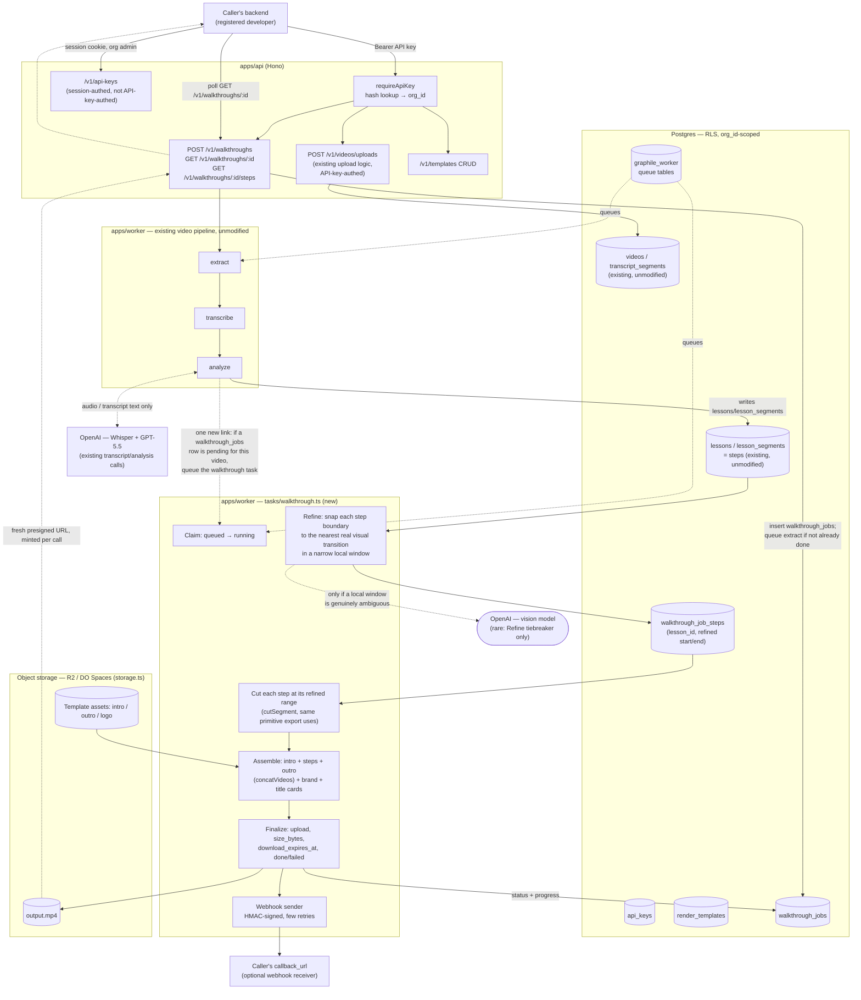

# CourseCut Walkthrough API — R&D Plan

## 0. Scope

A new public, programmatic API — separate from the org-member web UI — that turns one uploaded screen recording, narrated in the caller's own voice, into a polished step-by-step product walkthrough video: intro, one clip per step (cut precisely at the moment each step's action happens, not just wherever the narration lands), an optional title card per step, the org's brand, and an outro. The response is a hosted URL to the finished file, with progress reported in between.

**This is deliberately "coursecut style."** The caller doesn't hand over pre-cut clips, click coordinates, or a DOM event log — they upload one video, the same way a video reaches this codebase everywhere else, and the *existing* transcription-and-analysis pipeline does the actual work of finding the steps:

* **Extract + transcribe** (unmodified `extract`/`transcribe` jobs) turn the narration into text, exactly as for a lecture.
* **Analyze** (unmodified `analyze` job, same GPT-5.5 call `domain/lessons.ts` already makes) finds the step boundaries from that transcript. A "step" *is* a `lessons` row — same table, same AI call, same per-org `analysisInstructions` knob already used to steer the prompt — just read as "steps in a task" instead of "topics in a lecture." No new prompt-writing, no new table.
* A new **Refine** stage exists because narration timing and action timing don't coincide — someone says "now I'll click Save" a beat before or after actually clicking it. Refine snaps each transcript-derived boundary to the nearest real visual transition in a *narrow* local window of video around it (a few seconds, not the whole recording), so the cut lands on the actual action.
* A new **Assemble** stage cuts each step at its refined boundary (reusing the exact `cutSegment`/`concatVideos` primitives `tasks/export.ts` already uses), stitches them with the org's intro/outro and brand, and uploads the result.

An earlier design in this same doc used a Chrome extension to log click coordinates and DOM element text, with a vision-model fallback for anything unlabeled. That's not discarded — it's a **planned future add-on**, kept in §11, exposed as its own separate API call rather than blended into the flow below: this plan builds the narration-driven flow first because it gets a *better* signal (a human explaining intent, not a click's raw coordinates) out of a pipeline that already exists and is already paid for, at the cost of one narrow new job kind instead of a whole detection subsystem. The click-based mode is what a caller *without* narration would use later — a different endpoint for a different input shape, not a fallback bolted onto this one.

Privacy is now the same rule as the rest of the product, not a narrower version of it: only extracted audio and transcript text ever reach OpenAI (`coursecut-privacy-invariants`, unchanged). The one narrow exception is a rare vision-model tiebreaker inside Refine, covered in its own section below, and it is the exception, not the routine path.

## Architecture diagram

Unnumbered deliberately, so it never has to shift if a numbered section above it changes — every `§N` cross-reference in this doc points at the sections below, not at this one.



## 1. Why this is cheap

Reuse, concretely — and this design reuses more of the existing product than the superseded one did:

* **The entire video pipeline** — `extract`, `transcribe`, `analyze`, the `videos`/`transcript_segments`/`lessons`/`lesson_segments` tables, the per-org `analysisInstructions` prompt knob, the content-hash transcript cache — all unmodified. A "step" is a `lessons` row; nothing about that table, its AI call, or its RLS policy changes.
* **ffmpeg primitives** — `probeDuration`, `cutSegment`, `concatVideos` (`ffmpeg.ts`) reused directly by the new `walkthrough` task, the same way `tasks/export.ts` already uses them for a multi-segment lesson export.
* **Upload** — the exact presigned-PUT flow `routes/videos.ts` already implements (`POST /projects/:id/uploads` → PUT to storage → `POST /videos/:id/complete`) is exposed under API-key auth instead of session auth; the underlying ticket-minting/completion logic isn't duplicated (§4).
* **Auth/tenancy, queue, storage, quotas** — same as the superseded design: RLS + `withOrg()`, `graphile-worker` + `jobs` projection, `storage.ts` as the only S3-talking file, `org_settings` + `usage_events`.

What's genuinely new: API keys, brand templates, the `walkthrough_jobs`/`walkthrough_job_steps` tables, the Refine stage's local scene-detection + rare vision tiebreaker, the Assemble stage, a webhook sender, and **one small piece of orchestration glue**: `analyze`'s success handler gains one more responsibility — if the video has a pending `walkthrough_jobs` row, queue the `walkthrough` task next. That's the one new link in an otherwise unmodified chain, and it's worth naming rather than glossing over as free reuse.

## 2. New surfaces

### 2.1 API keys — hand-rolled, not a `better-auth` plugin

Checked before assuming otherwise: **`better-auth` (installed `1.6.25`, and current `1.7.1`) ships no `api-key` plugin.** Its plugin export map (`node_modules/better-auth/package.json`) lists `organization`, `admin`, `bearer`, `jwt`, `two-factor`, etc. — no `api-key`. (`bearer` forwards a session token as a header instead of a cookie; it's not a long-lived developer credential and doesn't fit here.) So this is the one place this plan adds auth code the library doesn't hand us, which is exactly the situation `auth.ts`'s header comment says to avoid — the mitigation is to keep it minimal and boring:

* A key is `cc_live_<32 random bytes, base62>`. Generated server-side only; the caller never chooses one.
* Stored as `sha256(key)`, not the key itself — API keys have enough entropy from generation that a slow hash (bcrypt/scrypt, for *user-chosen* passwords) buys nothing and costs latency on every request. This is the same reasoning Stripe/GitHub/most API-key implementations use.
* The stored row also keeps a `key_prefix` (first 12 chars) so a key list UI can show `cc_live_4f8a...` without ever re-displaying the secret.
* `requireApiKey` middleware, parallel to `requireOrg` (`http/context.ts`): hash the `Authorization: Bearer <key>` header, look up the row, resolve `orgId` directly from it (no session, no membership re-check needed — the key *is* the org-scoped credential). Sets the same `AppEnv` variables (`orgId`, plus a `keyId` instead of `userId`) so every existing `tx()`-based route pattern and RLS policy works unchanged under either auth path.
* Key management (`POST /v1/api-keys`, `DELETE /v1/api-keys/:id`, `GET /v1/api-keys`) sits behind the *existing* session-based `requireOrg`, because minting a credential is an org-admin action taken from the dashboard, not something the API authenticates itself.

### 2.2 Templates — a stored, reusable brand config

An org sets this up once, not on every call:

* Intro clip, outro clip (object keys, uploaded the same presigned-PUT way as everything else — no new upload mechanism).
* Brand colors (primary/secondary, hex) and an optional logo (PNG, object key), used for a per-step title card and a corner watermark.
* `voiceover_mode` default `'none'` — the caller's own narration, already in the source recording, *is* the walkthrough's voiceover. This exists as an override for a caller who later wants to replace or duck their narration under a different track, not as something the primary flow needs.
* Target output spec: resolution + fps + container, used only to normalize the intro/outro (separate pre-made assets) to match the source recording — the step clips themselves need no normalizing (§6).

### 2.3 Walkthrough jobs — the actual unit of work

A walkthrough job takes a `video_id` (from an upload made via §2.1's auth, or an already-uploaded video), a `template_id`, and an optional `callback_url`. It drives the *existing* video pipeline to completion if it hasn't run yet (extract → transcribe → analyze), then runs the new `walkthrough` task (Refine → cut → assemble → upload), and reports status the same way an export does (`queued → running → done|failed`), plus a progress fraction.

Videos created through this API attach to a **singleton `_api` project**, auto-created per org on first use. An API caller has no notion of "projects" — that's a web-UI organizing concept — so this exists purely to satisfy `videos.project_id`'s existing composite FK without a schema change, and the caller never sees or names it. Race-safe by construction rather than by locking: the project's `id` is deterministic (`` `${orgId}:_api` ``, not `newId()`), so the upload route inserts it with `ON CONFLICT (id) DO NOTHING` and proceeds — two concurrent first uploads for the same org both "create" the same row and neither errors.

## 3. Data model (additive — nothing existing changes)

```
api_keys
  id, org_id, key_hash, key_prefix, name, created_at, last_used_at, revoked_at

render_templates
  id, org_id, name,
  intro_key, outro_key, logo_key (nullable),
  brand_primary_hex, brand_secondary_hex (nullable),
  target_width, target_height, target_fps,
  voiceover_mode default 'none' ('none' | 'replace' | 'duck'),
  created_at, updated_at

walkthrough_jobs
  id, org_id, video_id, template_id,
  status ('queued'|'running'|'done'|'failed'|'cancelled'), progress (0..1),
  output_key, error,
  callback_url (nullable),
  size_bytes, download_expires_at,
  created_at

walkthrough_job_steps
  id, org_id, walkthrough_job_id, lesson_id, sort_order,
  refined_start, refined_end (doublePrecision — Refine's output; the trim range Assemble
    actually cuts, distinct from lessons.start/end, see "Why refined bounds live here, not
    on lessons")
```

`api_keys`/`render_templates`/`walkthrough_jobs`/`walkthrough_job_steps` join `TENANT_TABLES` (`db/schema.ts`) and get the same RLS policy every other tenant table gets — no exception carved out for "it's an API, not the UI." `videos`/`transcript_segments`/`lessons`/`lesson_segments` need no changes at all; `walkthrough_job_steps.lesson_id` is a plain reference into the existing `lessons` table.

`jobs.kind` gains a `"walkthrough"` value alongside `extract`/`transcribe`/`analyze`/`export`, with `jobs.walkthroughId` added the same way `jobs.exportId` exists today.

### Why refined bounds live here, not on `lessons`

Refine's output is specific to *this* walkthrough attempt's need for a click-accurate cut. `lessons.start`/`.end` are a cached bound recomputed from `lesson_segments` (`db/schema.ts`'s own comment: "a cached derived bound... recomputed after every segment write") and are read by the ordinary lesson editor UI for a completely different purpose. Writing Refine's snapped boundary into that shared column would be a surprising side effect for anything else reading that video's lessons — so `walkthrough_job_steps` keeps its own copy, and the shared table's semantics stay exactly what the rest of the product already expects.

## 4. API surface

```
POST   /v1/videos/uploads               { filename, size, content_type }
                                         → { video_id, storage_key, upload: {...} }
                                         (same ticket-minting logic as
                                          POST /projects/:id/uploads, minus the
                                          project param — resolves the singleton
                                          _api project itself)
POST   /v1/videos/:id/upload/part-urls  (unchanged from the existing route)
POST   /v1/videos/:id/complete          (unchanged from the existing route)

POST   /v1/templates                    create a brand template
GET    /v1/templates/:id                fetch one
PATCH  /v1/templates/:id                update
GET    /v1/templates                    list

POST   /v1/walkthroughs                 { video_id, template_id, callback_url? }
                                         → 202, { id, status: "queued" }
GET    /v1/walkthroughs/:id             → { id, status, progress, output_url?, error? }
                                         (output_url present only once status = "done";
                                          re-minted fresh on every call, §9)
GET    /v1/walkthroughs/:id/steps       → [{ lesson_id, title, summary, start, end }, ...]
                                         (reads lessons for this job's video — lets a
                                          caller see what steps were actually found)
POST   /v1/walkthroughs/:id/cancel

POST   /v1/api-keys   GET /v1/api-keys   DELETE /v1/api-keys/:id      (session-authed, §2.1)
```

All under `requireApiKey` except the key-management routes. No SSE endpoint for this API — an external HTTP client polling `GET /v1/walkthroughs/:id` or receiving one webhook is a simpler contract than asking every integrator to hold an SSE connection open server-to-server.

## 5. Ingestion

Direct upload (above) is the only ingestion path this plan builds. It reuses existing, already-hardened code — the browser/caller PUTs bytes straight to storage, exactly as today's web app does — so there is no caller-supplied URL for the server to fetch, and no SSRF surface to defend at all for this feature. That's a deliberate simplification from the superseded design, which needed its own SSRF-safe fetcher because its primary path *was* a caller-hosted URL. If a URL-based secondary mode (matching the very first version of this ask — "the video is already hosted on DigitalOcean") is wanted later, the fetcher design from that earlier pass (reject non-https, resolve and reject private/link-local ranges, re-validate every redirect, cap size and timeout) is still the right approach and can be added without touching anything in this version — it just isn't built until something needs it.

## Step identification & boundary refinement

Also unnumbered, for the same reason the architecture diagram is.

### Step identification: reuse `analyze`, don't rebuild it

`analyze` already turns a transcript into an ordered list of `{ start, end, title, summary }` rows via one structured GPT-5.5 call (`domain/lessons.ts`). Asked to find "topics in a lecture," it finds lesson boundaries; nothing about the call changes to make it instead find "steps in a narrated task" — the per-org `analysisInstructions` field (`org_settings`, already free-text and already appended to the prompt) is the existing extension point for steering that, and a walkthrough-oriented org can set it once ("segment by distinct user actions, not by topic") without a code change. The caption for each step comes from `lessons.title`/`.summary` — built from what the person actually said, which is a better source than a vision model's guess at pixels ever was in the superseded design.

### Refine: because narration timing isn't action timing

A transcript boundary says roughly *when* a step starts, not exactly when the click happened. Someone narrating "now I'll click Save" might click a beat before or after saying it. Refine exists to close that gap, and it does so cheaply because the transcript boundary already narrows the search to a few seconds instead of the whole recording:

1. For each `lessons` row (in order), look at a small local window of the source video centered on its transcript-given start: **±3 seconds** by default (`REFINE_WINDOW_SECONDS`, env-overridable, same `optional("NAME", default)` pattern as every other tunable in `env.ts`). A starting default, not an empirically-tuned one — real narrated recordings are what W4 tunes it against, per §11.
2. Run a scene-change/frame-difference pass over just that window (`ffmpeg`'s `select='gt(scene,…)'` at a **0.3** threshold by default — `REFINE_SCENE_THRESHOLD`, same override pattern) — cheap, because it decodes a few seconds, not the whole video.
3. If one transition clearly dominates the window, snap the boundary to it. This is the expected case — a UI click produces a sharp, unambiguous visual change — and it costs no model call at all.
4. If the window is genuinely ambiguous (no single dominant transition — a slow fade, or several similar-magnitude changes close together), send just the handful of candidate frames from that narrow window to a vision-capable model, asking which one shows the action actually complete. This is the **only** place this feature calls a vision model, it operates on a few frames from a few seconds of video, and it's expected to be rare, not routine, unlike the superseded design's fallback tier.

The result — `walkthrough_job_steps.refined_start`/`.refined_end` — is what Assemble actually cuts on.

## 6. Pipeline

Two phases: the existing video pipeline (unmodified), then the new `walkthrough` task, mirroring `tasks/export.ts`'s claim → encode → finalize shape.

**Existing pipeline (reused verbatim):**

1. `extract` — audio pulled from the uploaded video, exactly as for a lecture.
2. `transcribe` — Whisper, exactly as for a lecture, including the per-org content-hash cache.
3. `analyze` — GPT-5.5 finds step boundaries, writes `lessons`/`lesson_segments`. On success, one new check: if a `walkthrough_jobs` row is waiting on this video, queue the `walkthrough` task.

**`apps/worker/src/tasks/walkthrough.ts` (new):**

4. **Claim**: `queued → running`, guarded by `status = 'queued'` (same race the export job guards against).
5. **Refine**: for each `lessons` row belonging to this video, resolve `refined_start`/`refined_end` as described above; write one `walkthrough_job_steps` row per lesson.
6. **Cut**: for each step, `cutSegment` the source video at its refined range — the same primitive `tasks/export.ts` uses per `lesson_segments` entry, applied here to Refine's tighter range instead.
7. **Assemble**: intro + cut steps (in order) + outro, via `concatVideos` — plus, per step, an optional title-card overlay (`drawtext`, from that step's `lessons.title`) and the template's brand color/logo, burned in before the concat. No per-step resolution normalizing is needed here: every step clip was just cut from the *same* uploaded recording by the *same* tool, so there's no heterogeneous-input problem to solve — only the intro/outro (separate pre-made assets) may need scaling to match the recording's resolution.
8. **Upload + finalize**: same as `tasks/export.ts` — upload, record `size_bytes`, set `download_expires_at`, write `done`/`failed`, and on `callback_url` presence, enqueue a webhook delivery (§7). Cancellation checked between every ffmpeg invocation exactly as the export job does.

## 7. Progress & completion delivery

* `GET /v1/walkthroughs/:id` is authoritative — poll it any time; `progress` spans the whole chain (extract/transcribe/analyze, when they still need to run, then Refine/Cut/Assemble), duration-weighted the same way `encodeAndUpload` weights multi-segment exports today.
* `callback_url`, if given, gets **one** POST on terminal state (`done` or `failed`), body `{ id, status, output_url?, error? }`, signed with an HMAC header (`X-CourseCut-Signature`, key = a per-org webhook secret set alongside the API key) so a receiver can verify it didn't come from someone else. Delivery is fire-and-forget: 3 attempts, backoff 30s / 5min / 30min (§11), recorded on the `walkthrough_jobs` row — not a durable webhook queue with a dashboard; that's real scope this plan doesn't take on.
* No delivery guarantee beyond that retry — the polling endpoint is the source of truth precisely so a lost webhook isn't a lost result.

## 8. Quotas & rate limiting

* Transcription is already metered (`TRANSCRIPTION_SECONDS`, `quota.ts`) and needs no change — a walkthrough's audio costs exactly what a lecture's would, same meter, same monthly ceiling.
* New metered kind: `walkthrough_output_seconds` — the finished output's duration, recorded once on success, same "record what actually happened, after the fact" rule as the existing kinds.
* A second, deliberately small metered kind: `vision_tiebreak_calls` — one unit per ambiguous-window vision call Refine actually makes. Expected to be zero or near-zero for most videos, unlike the superseded design's `vision_frames_analyzed`, which was a routine cost.
* `assertCanWalkthrough()` alongside `assertCanExport()`: suspended check, active-job cap, storage headroom, plus the new monthly output-seconds ceiling.
* A hard per-video cap on step count: **40** by default (`WALKTHROUGH_MAX_STEPS`, a fixed constant, not an org setting) — bounds worst-case Refine/Cut work per job independent of what a single (mis-)analyzed video's transcript produced. `analyze` finding more than this fails the job with a clear message rather than silently truncating.
* `analyze` finding **fewer than 2** steps, or exactly one step spanning **≥90%** of the video's duration, also fails the job (`"could not identify distinct steps in this narration — try narrating each action as its own clearly-paced step"`) rather than silently producing a one-clip "walkthrough" that isn't really one.
* New `org_settings` columns, same nullable-override shape as the existing ones: `walkthrough_minutes_limit`, and reuse `storage_bytes_limit` / `max_active_jobs` as-is.
* Rate limiting (`http/rate-limit.ts`) needs a second key function: today's `consume(...)` buckets are keyed by `userId`, which doesn't exist on an API-key request. Same buckets, keyed by `keyId` instead — `POST /v1/walkthroughs`, `POST /v1/videos/uploads`, and `POST /v1/templates` join the `EXPENSIVE` bucket's path list.

## 9. Output delivery

Same answer as `exports.ts`'s download URL: a presigned GET, not a permanently public object — R2/DO Spaces bucket hostnames never reach a caller any more than they reach the SPA (`storage.ts`'s rule 3). `GET /v1/walkthroughs/:id` mints a fresh presigned URL on every call rather than storing one, so `output_url`'s TTL is "however long ago you last asked," not a fixed expiry the caller has to race. `download_expires_at` (same column shape as `exports`) is when the *object itself* is deleted by a retention sweep, not when the URL expires — those are different clocks, same as today.

## 10. Milestones (rough)

* **W1** — `api_keys` table + `requireApiKey`, key management routes behind session auth. No walkthrough logic yet; provable with a `GET /v1/whoami`-style smoke route.
* **W2** — `render_templates` CRUD, reusing the existing presigned-upload flow for intro/outro/logo assets.
* **W3** — `walkthrough_jobs`/`walkthrough_job_steps`, the API-key-authed upload routes and singleton `_api` project, the orchestration link from `analyze` into the new `walkthrough` task, and a first version of `tasks/walkthrough.ts` that trusts `lessons.start`/`.end` as-is (no Refine yet) for the cut+assemble. Proves the whole "reuse the video pipeline for step-finding" idea end to end before adding precision.
* **W4** — Refine (local scene-detection snap + rare vision tiebreaker), per-step title cards, brand overlay, webhook delivery, quotas wired in.
* **W5 (future add-on, separate API)** — the click-based mode for callers without narration: the Chrome-extension click log, `render_click_events`, the three-tier click/caption resolution, and highlight/zoom, shipped as its own endpoint rather than folded into `POST /v1/walkthroughs`. Not scheduled against a version here — see §11 Open for what's still undecided about its shape.

## 11. Decisions

### Settled

| Decision | Rejected | Why |
|---|---|---|
| Hand-rolled API keys, hashed, in a new `api_keys` table | `better-auth`'s `api-key` plugin | Verified against the installed and current versions: no such plugin ships. Rolling this by hand is the one exception to "the library's crypto beats ours" (`auth.ts`), forced by the library simply not offering it |
| Plain `sha256` for key storage, not bcrypt/scrypt | Slow password-style hashing | Keys are generated with enough entropy that a slow hash defends against nothing a fast one doesn't, and adds latency to every authenticated request |
| Templates as a stored, reusable resource | Full brand config inline on every call | An org has one brand, many walkthroughs; a `template_id` keeps the payload small and gives something to version |
| Polling as the source of truth, webhook as a convenience notification | Webhook-only | A lost webhook must not mean a lost result for a server-to-server integration |
| A "step" is a `lessons` row, produced by the existing unmodified `analyze` job | A new AI prompt/pipeline for "steps" specifically | The problem — find meaningful time-ranges in a transcript — is identical; the existing per-org `analysisInstructions` field is already the extension point for steering it toward task-steps instead of lecture-topics |
| Direct presigned-PUT upload as the only ingestion path in this plan | Requiring or defaulting to a caller-hosted URL the server fetches | Reuses already-hardened code with zero new SSRF surface; a URL-based secondary mode is still possible later (§5) but isn't built until something needs it |
| Refine snaps each transcript boundary to the nearest real visual transition in a narrow local window | Trusting the transcript boundary as the cut point | Narration timing and action timing don't coincide; a narrow local scan is cheap specifically because the transcript already narrows the search to a few seconds |
| Refined boundaries stored on a new `walkthrough_job_steps` row, not written back onto `lessons` | Updating `lessons.start`/`.end` in place | `lessons`'s cached bound is read by the ordinary lesson editor for a different purpose; writing a walkthrough-specific refinement into a shared column would be a surprising side effect elsewhere in the product |
| Assemble calls `cutSegment`/`concatVideos` directly inside the new `walkthrough` task, rather than queuing one `exports` row per step | Reusing the `exports` table/job machinery per step | `exports` carries UI-facing state (pause/resume/retry, a standalone downloadable-clip concept) that doesn't map onto an internal step of one larger automated assembly, and would require writing a step's boundary into shared `lesson_segments` rows just to get it in |
| Per-step visual treatment limited to an optional title card (from `lessons.title`) | Highlight ring + zoom-to-click (from the superseded click-detection design) | There's no click coordinate in this design at all — only *when* a transition happens, never *where* on screen — so there's nothing for a highlight or zoom to target |
| `vision_tiebreak_calls` metered separately from `walkthrough_output_seconds`, and expected near zero | Treating it as a routine cost like the superseded design's `vision_frames_analyzed` | It only fires for a genuinely ambiguous local window, not once per step, so bundling it into a flat per-render cost would misprice the common case |
| Refine's local window default `±3s` (`REFINE_WINDOW_SECONDS`), scene-change threshold default `0.3` (`REFINE_SCENE_THRESHOLD`), both env-overridable | Hardcoding either, or waiting to build Refine until "the right number" is known | A starting default unblocks building W4 now; the `optional("NAME", default)` pattern already used throughout `env.ts` means tuning against real recordings later is a config change, not a code change |
| Per-video step cap: **40** (`WALKTHROUGH_MAX_STEPS`, fixed constant, not an org setting); `analyze` exceeding it fails the job rather than truncating silently | An org-configurable limit, or silently keeping only the first 40 | A fixed ceiling bounds worst-case Refine/Cut work independent of a single mis-analyzed transcript; truncating silently would ship a "complete" walkthrough that's secretly missing its last steps |
| `analyze` producing fewer than 2 steps, or one step spanning ≥90% of the video, fails the `walkthrough_jobs` row with a specific message | Producing a one-clip "walkthrough" anyway | A single giant clip isn't the product being sold here, and a clear failure is more useful to the caller than a technically-successful, useless result |
| Webhook retry: 3 attempts (matches `MAX_ATTEMPTS` in `jobs/queue.ts`'s own "unexpected failure, not a user-facing retry" reasoning), backoff 30s / 5min / 30min | An unbounded or single-attempt retry | Long enough to ride out a receiver's brief downtime, bounded enough that a permanently-dead `callback_url` doesn't hold worker resources; the polling endpoint is the fallback either way (§7) |
| Rate limiting reuses the existing `GENERAL` (600/min) and `EXPENSIVE` (120/min) constants verbatim, keyed by `keyId` instead of `userId` | New, separate limits for API-key traffic | No evidence yet that API traffic needs different numbers from session traffic; reusing the constants means one place to tune later instead of two |
| `voiceover_mode: 'replace'/'duck'` (§2.2) not built in W1–W4; revisit on demand | Building it alongside the primary flow | The primary flow's narration already serves as the voiceover; building the override before any caller asks for it is speculative scope |
| The future click-based add-on gets its own route, `POST /v1/walkthroughs/from-clicks`, rather than a `mode` field on `POST /v1/walkthroughs` | Branching one route on a `mode` field | The two input shapes (narration+video vs. video+click-log) share no request body; branching inside one route would mostly be an if/else splitting two unrelated implementations |

### Future add-on: a separate click-based API, for callers without narration

Not built in this pass, and deliberately not blended into `POST /v1/walkthroughs` as a fallback — it's a different input shape (a Chrome extension's click log instead of narration) and belongs behind its own endpoint, `POST /v1/walkthroughs/from-clicks`, once the narration-driven flow above is proven. A previous pass of this doc designed it in full: a Chrome extension capturing click coordinates and DOM element text/selector per step, a three-tier fallback (extension DOM text → coordinates only → vision-model-on-change-frames), and a `Segment` stage cutting the source video at the midpoint between consecutive clicks. None of that was wrong — it's the right design *for click-based input specifically* — it just isn't this plan's primary flow, because a caller who's already narrating gets a richer signal for free.

| Design element (for the future add-on) | Why it fits click-based input specifically |
|---|---|
| `render_click_events` + a three-tier click/caption resolution (extension DOM text → coordinates → vision model) | The right fallback order when the only signal is a Chrome extension's click log, with no narration to lean on at all |
| `Segment` cutting at the midpoint between consecutive click timestamps | Non-overlapping by construction, when boundaries have to come from click timestamps rather than a transcript |
| Highlight ring (from `brand_primary_hex`) + zoom punch-in per click | Only meaningful when a click's exact screen coordinate is known, which this add-on's input shape provides and narration alone doesn't |
| Retiring the `ffmpeg-server` Render prototype outright; salvaging only its `adelay`/`volume`/`amix` audio-mix filter graph | Still true regardless of which mode ships it — see "Open" below, since either mode's `voiceover_mode: 'replace'`/`'duck'` (§2.2) would reuse exactly that mixing shape |

### Open

Everything that was a technical unknown in earlier passes is pinned down above. What's left isn't — deliberately, because neither is a tech-spec decision this doc can make on its own:

| Question | Why it's not settled here |
|---|---|
| Pricing / plan tiers for `walkthrough_output_seconds` | A business decision (margin over OpenAI + droplet cost, market rate), not a technical one — same open status as the web app's own pricing (§10 of `web-app-plan.md`). Nothing in W1–W4 depends on this being answered first |
| Whether the future click-based add-on's tables (`walkthrough_jobs`/`walkthrough_job_steps` vs. its own) get shared or duplicated, and whether the extension-side click-log work is scoped anywhere | Both depend on the add-on actually being scheduled, which it isn't yet (§ "Future add-on" above) — deciding now would be planning a project that doesn't have a start date |
