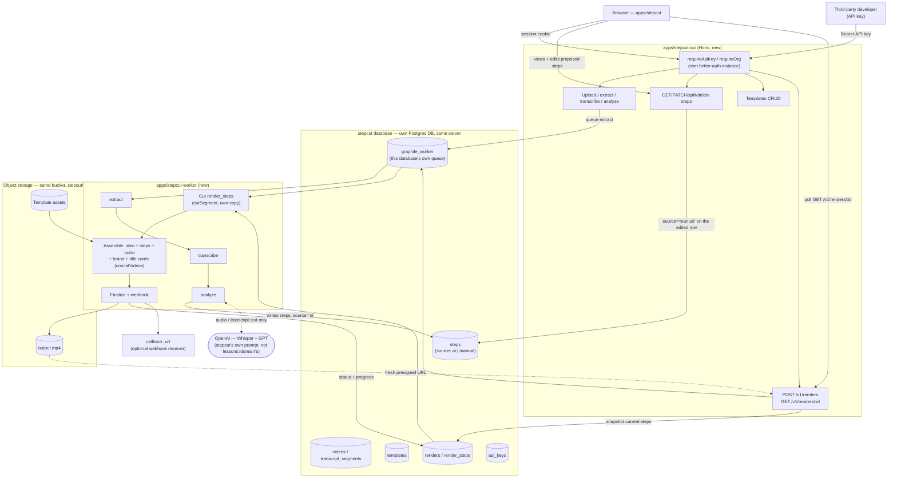

# StepCut — Product & Technical Plan

"StepCut" is a working name, adopted here for concreteness — not a final brand decision, and nothing in this design depends on it.

## 0. Scope

A new, standalone product for turning one uploaded, narrated screen recording into a polished step-by-step tutorial video: transcript → AI-proposed steps → **the user reviews and edits those steps by hand** (boundaries, titles, splits, merges) → a final render with intro/outro, a title card per step, and the org's brand. Available both as a web app (upload, review, download) and as a public API for a registered developer to integrate programmatically — the same backend serves both.

Three decisions shape everything below, all made explicitly rather than inherited by default:

* **A separate backend from `apps/api`/`apps/worker`, on the same DigitalOcean droplet.** Not a set of new routes bolted onto the existing coursecut-web backend — its own API, its own worker, its own database. The stated reason is the right one to build around: the step-detection approach here is expected to change frequently, and a shared backend would mean every experiment risks the shipped lesson-extraction product. Same droplet, because there's no reason to pay for a second one — isolation comes from a separate database and a separate queue, not a separate machine (§8).
* **No click detection, no browser extension.** An earlier pass of this planning process designed a Chrome-extension-based click-capture mode in real detail; that's dropped outright, not deferred. The whole pipeline is transcript-driven, and precision comes from a human editing the AI's proposed step boundaries, not from any automated visual detection.
* **A new sibling app, `apps/stepcut`, matching `apps/web`'s design system.** Same Tailwind v4 + shadcn/ui (`radix-nova` style, neutral base, `lucide` icons) conventions `components.json` and `apps/web` already establish, copied the same way `apps/web` copied the desktop app's UI — its own implementation, not shared code.

## Architecture diagram

Unnumbered deliberately, so it never has to shift if a numbered section above it changes.



## 1. Copied pattern vs. shared infrastructure

Worth being explicit about which is which, since "separate backend, same droplet" only works if this distinction is kept clean:

**Copied (own implementation, proven approach):**
* better-auth + organization plugin + Postgres RLS for tenancy — the same shape `apps/api/src/auth.ts` and `db/schema.ts` already validate, in a fresh set of tables.
* `graphile-worker` as the queue, with a `jobs` table as the tenant-visible projection — same split as `apps/api/src/jobs/queue.ts`.
* `storage.ts`'s "one file talks to S3, keys not URLs, presigned PUT/GET" discipline — its own copy, pointed at the same bucket.
* `quota.ts`'s usage-metering shape (`org_settings` overrides, `usage_events` append-only ledger).
* The extract → transcribe → analyze pipeline *technique* — Whisper for audio, a structured GPT call for boundaries — reimplemented with its own prompt, tuned for "steps in a task" from day one rather than adapted from "topics in a lecture."
* The "AI proposes, a manual edit is first-class and takes precedence" UX pattern the existing lesson editor already ships (`lessons.source = 'ai' | 'manual'`) — the interaction design is worth porting even though the code isn't.

**Shared (infra-level only, nothing at the application layer):**
* The DigitalOcean droplet itself.
* The Postgres *server process* — a new `stepcut` database on it, not a new server.
* The object storage *bucket* — a disjoint `stepcut/` key prefix, not a new bucket.
* Caddy, as the one TLS-terminating reverse proxy for both stacks.

**Not shared at all:** database schema, auth/session/org tables, any application code, any table row. A `stepcut` org has nothing to do with a coursecut org, even for the same signed-in person.

## 2. Runtime architecture

* **`apps/stepcut`** — the frontend. Vite + React + TypeScript, same as `apps/web`; same `components.json` config (shadcn/ui `radix-nova`, `lucide-react`, Tailwind v4) so the two apps look like siblings, built independently.
* **`apps/stepcut-api`** — a new Hono API: its own `env.ts`, its own Drizzle schema against the `stepcut` database, its own `auth.ts` (a fresh better-auth instance — new signups, new orgs, unrelated to coursecut's).
* **`apps/stepcut-worker`** — a new `graphile-worker` consumer, pointed only at the `stepcut` database. This is what actually delivers the isolation the separate-backend decision is for: a long StepCut render can never starve a coursecut export (or the reverse) for the droplet's limited CPU, because they're two independent single-concurrency queues, not one shared one.

## 3. Data model (fresh database — nothing here is a coursecut table)

```
users, sessions, accounts, verifications, organizations, members, invitations
  -- the same seven better-auth + organization-plugin tables apps/api already
  -- has, generated fresh into the stepcut database. A copied convention, not
  -- a shared table — a stepcut user has no relationship to a coursecut one.

api_keys
  id, org_id, key_hash, key_prefix, name, created_at, last_used_at, revoked_at

templates
  id, org_id, name,
  intro_key, outro_key, logo_key (nullable),
  brand_primary_hex, brand_secondary_hex (nullable),
  target_width, target_height, target_fps,
  created_at, updated_at

videos
  id, org_id, storage_key, upload_status, duration, content_hash, audio_key,
  transcript_status, size_bytes, created_at, updated_at
  -- same shape as coursecut's videos table, because the upload/extract/
  -- transcribe problem is identical — a fresh copy, not a shared row

transcript_segments
  id, org_id, video_id, start, end, text

steps
  id, org_id, video_id, sort_order, start, end, title, summary,
  source ('ai' | 'manual'), confidence (nullable, ai-only), updated_at
  -- what coursecut calls a "lesson," named for what it actually is here.
  -- `source` mirrors lessons.source exactly: re-running analyze only ever
  -- replaces the 'ai' rows, so an edited step survives a re-analysis

renders
  id, org_id, video_id, template_id,
  status ('queued'|'running'|'done'|'failed'|'cancelled'), progress (0..1),
  output_key, error, callback_url,
  size_bytes, download_expires_at, created_at

render_steps
  id, org_id, render_id, step_id (nullable — traceability only),
  sort_order, start, end, title
  -- a SNAPSHOT of each step at the moment POST /v1/renders was called.
  -- Cut/Assemble read only this table, never `steps` directly — editing a
  -- step after queuing a render must not change what that render already
  -- produced, or is producing

jobs
  id, org_id, kind ('extract'|'transcribe'|'analyze'|'render'), state,
  video_id (nullable), render_id (nullable), attempt, progress, detail,
  error, created_at, updated_at
```

Every tenant-scoped table above gets the same RLS-by-`org_id` policy coursecut's own `TENANT_TABLES` convention uses — copied as a practice, applied fresh.

## 4. API surface

```
POST   /v1/videos/uploads                { filename, size, content_type }
POST   /v1/videos/:id/upload/part-urls
POST   /v1/videos/:id/complete
                                          -- the same presigned-PUT shape coursecut already
                                          -- validated; a fresh implementation here

POST   /v1/videos/:id/extract            -- chains to transcribe on success, same as today
POST   /v1/videos/:id/analyze            -- writes `steps`, source='ai'
GET    /v1/videos/:id/steps              -- the current steps, AI-proposed or since-edited

PATCH  /v1/steps/:id      { start?, end?, title?, summary? }   -- sets source='manual'
POST   /v1/steps/:id/split               { at }                -- one step becomes two
DELETE /v1/steps/:id
POST   /v1/videos/:id/steps              { start, end, title }  -- add a step by hand

POST   /v1/templates   GET/PATCH .../:id   GET (list)

POST   /v1/renders                       { video_id, template_id, callback_url? }
                                          -> 202 { id, status: "queued" }
                                          (snapshots the video's *current* steps into
                                           render_steps at the moment of this call)
GET    /v1/renders/:id                   -> { id, status, progress, output_url?, error? }
POST   /v1/renders/:id/cancel

POST/GET/DELETE /v1/api-keys             (session-authed)
```

The whole surface is available under API-key auth — this is still meant to be a general-purpose API, and the step-editing routes exist for exactly the reason a caller might want their own review UI, not only StepCut's own. `apps/stepcut`'s web app is simply the first, primary consumer, authenticating the ordinary session way (`requireOrg`), same as `apps/web` already does against `apps/api` today.

## 5. Pipeline: AI proposes, a human confirms

1. **Upload** — the presigned-PUT flow, a fresh copy of the same technique.
2. **Extract → transcribe** — audio pulled and sent to Whisper, same technique as coursecut, independent implementation.
3. **Analyze** — a GPT call over the transcript proposes `steps` (`start`/`end`/`title`/`summary`), `source = 'ai'`. Built as its own prompt from the start — not a fork of `domain/lessons.ts` — because the freedom to iterate on this prompt and its heuristics without touching the shipped lesson product is the entire reason a separate backend was chosen in the first place.
4. **Review & edit** (new, and the core of this design, not a fallback) — in `apps/stepcut`'s UI, the user sees the proposed steps against the video (a scrubber, a title, a summary per step) and can drag a boundary, retitle, split a step that actually covers two actions, merge two that are really one, delete a spurious one, or add a manual one. Any touched row flips to `source = 'manual'` — the same "AI proposes, a manual edit sticks" rule `lessons.source` already enforces, ported as an interaction pattern into a new UI. This is what replaces the automated visual-detection "Refine" stage from the earlier click-based design: a person looking at the actual footage is a more reliable corrector than a heuristic, and StepCut already needs this editor regardless of how good `analyze` gets.
5. **Render** — `POST /v1/renders` snapshots the current `steps` into `render_steps`, then `stepcut-worker`'s `render` task cuts each snapshotted step (`cutSegment` — the identical technique `tasks/export.ts` uses, its own copy here) and assembles them in order with the template's intro, a per-step title card, brand color/logo, and outro (`concatVideos`), uploads the result, and finalizes.

### Where an automated boundary-assist could still fit, later

Not built now, and deliberately not assumed: a "snap to the nearest real cut" suggestion inside the step editor — the same local scene-detection idea the earlier design called Refine — is a reasonable enhancement to layer onto step 4 once the manual editor itself is proven, as a suggestion the human can accept or ignore rather than something that runs automatically. Because "the backend algorithms will change a lot" was the stated reason for this whole architecture, this section exists to name the option without committing to it.

## 6. Quotas, rate limiting, output delivery

* Same shape as `quota.ts`, against the `stepcut` database: `assertCanUpload`, `assertCanTranscribe`, `assertCanRender` (mirrors `assertCanExport`'s suspended/active-job/storage checks), `usage_events` recording `transcription_seconds` and `render_output_seconds` after the fact.
* Same shape as `rate-limit.ts`: a general bucket and an expensive-calls bucket, keyed by `keyId` for API traffic or `userId` for session traffic.
* Output delivery: a presigned GET minted fresh on every `GET /v1/renders/:id` call, never a permanently public object — the same reasoning `storage.ts`'s "bucket hostnames never reach a caller" rule already establishes.

## 7. Deployment on the shared droplet

* **One new Postgres database, not a new server.** The droplet's existing `postgres` container gains a second database, `stepcut`, alongside coursecut's. One server process, full schema isolation, no new container to provision or back up separately (though the existing `backup` service's dump should cover both databases, not just one — a small addition, not a new mechanism).
* **Same object storage bucket, a disjoint `stepcut/` prefix.** No new bucket, no new credentials to issue or rotate.
* **A dedicated `stepcut-worker` container**, pointed only at the `stepcut` database — its `graphile_worker` schema lives inside that database, entirely separate from coursecut's queue. This is the concrete mechanism behind §2's isolation claim: two independent worker processes, each with its own single-concurrency queue, so neither product's video processing can ever block the other's.
* **New Dockerfiles** (`infra/docker/stepcut-api.Dockerfile`, `stepcut-worker.Dockerfile`, `stepcut-web.Dockerfile`), mirroring the existing `api.Dockerfile`/`worker.Dockerfile`/`web.Dockerfile`; new service blocks in `compose.prod.yml`; a new `worker-scratch`-style volume for `stepcut-worker`'s own scratch space, kept separate so a stuck StepCut encode can't fill the disk coursecut's worker depends on.
* **A new Caddy block**, alongside the existing `{$APP_DOMAIN}` and `{$DB_DOMAIN}` blocks in the same `Caddyfile` — a new `{$STEPCUT_DOMAIN}` (or a path, if it ends up sharing a domain) proxying to `stepcut-web`/`stepcut-api`, with the same security headers and CSP discipline the existing block already applies. TLS, ACME, and `bootstrap-droplet.sh` are all shared as-is; nothing about provisioning the droplet itself needs to change.

## 8. Milestones (phased)

* **Phase 1 — Scaffold.** `apps/stepcut` (frontend shell matching `apps/web`'s design system), `apps/stepcut-api`, `apps/stepcut-worker`: own database + migrations, better-auth + organizations, `api_keys`, deployed as new droplet services end to end. A `/health` route and a signed-in empty dashboard prove the whole new stack is live before any product logic exists.
* **Phase 2 — Upload & transcript.** The presigned-upload flow, `extract`, `transcribe`, `videos`/`transcript_segments`. Provable by uploading a video and seeing its transcript — no steps yet.
* **Phase 3 — AI step proposal.** `analyze`, the `steps` table, `GET /v1/videos/:id/steps`, and a read-only view of the proposed steps in the UI. Provable by seeing AI-proposed steps after upload — no editing or rendering yet.
* **Phase 4 — Manual editing.** The step editor UI plus `PATCH`/`split`/`delete`/`POST /v1/steps`, porting the existing lesson editor's edit-then-persist interaction pattern. Provable by editing a step's boundary or title and seeing it stick through a page reload.
* **Phase 5 — Templates & render.** `templates` CRUD (reusing the presigned-upload flow for intro/outro/logo), `renders`/`render_steps`, the `render` worker task (cut + assemble + brand + title cards), webhook delivery. Provable by getting back one finished tutorial video, end to end, through the web UI.
* **Phase 6 — Hardening.** Quotas, rate limiting, retention/cleanup for old renders and source videos, an API-key management screen in the app itself, and the public developer-facing docs for the API surface in §4.

## 9. Decisions

### Settled

| Decision | Rejected | Why |
|---|---|---|
| Separate backend (`apps/stepcut-api`/`apps/stepcut-worker`), same droplet | (a) New routes/tables on the existing `apps/api`/`apps/worker`; (b) a fully separate droplet too | (a) risks the shipped lesson product every time this one's detection algorithms change, which is expected to be often; (b) isolation comes from a separate database and queue, not a separate machine — paying for a second droplet buys nothing this design doesn't already get |
| No click detection, no browser extension | Building the previously-designed Chrome-extension click-capture mode as a second input track | Explicitly dropped — narration + a human-edited transcript-based pipeline is now the only mode, not one of two |
| A human editing AI-proposed step boundaries replaces automated visual "Refine" as the precision mechanism | Building the local scene-detection snap first, editing as an afterthought | A person watching the actual footage is a more reliable corrector than a heuristic, and this editor is needed regardless of how good automated detection ever gets — building the fallback first would have been solving the easier, less necessary problem |
| Fresh `videos`/`steps`/`renders`/`render_steps` tables in a new `stepcut` database, not `videos`/`lessons`/`exports` reused from coursecut | Any form of cross-database or cross-schema table sharing | Required the moment the backend is separate, and matches the "own copy, not shared" convention `apps/web` already established for its UI |
| `render_steps` as an immutable snapshot taken at render time | Cutting directly from live `steps` rows at render time | Editing a step after queuing a render must not retroactively change a render that's in flight or already finished |
| Same object storage bucket, `stepcut/` key prefix | A new bucket and credentials | No new storage vendor or secret to manage; the existing per-org-prefix isolation pattern extends trivially to a per-product prefix |
| Same Postgres server, new `stepcut` database | A new Postgres instance/container | Full schema isolation without the resource cost of a second database server on a small droplet |
| Dedicated `stepcut-worker` process against its own queue | Sharing coursecut's worker/queue for stepcut jobs too | The concrete mechanism that delivers the stated isolation goal: two independent single-concurrency queues instead of one shared one |
| `analyze`'s prompt is StepCut's own, not a fork of `domain/lessons.ts` | Sharing or copy-pasting the lesson-boundary prompt and adjusting it | The freedom to iterate on this prompt without touching the shipped product is the whole reason this backend is separate — sharing the prompt file would quietly recreate the coupling the separate-backend decision exists to avoid |
| The full API surface (including step-editing routes) is available under API-key auth, not reserved for the web app | Making `PATCH /v1/steps/:id` etc. session-only | Keeps faith with the original "any registered user can use our API" goal — `apps/stepcut`'s UI is the first consumer, not a privileged one |

### Open

| Question | Why it's not settled here |
|---|---|
| Pricing / plan tiers | A business decision (margin over OpenAI + droplet cost, market rate), not a technical one |
| Final product name and domain/subdomain | "StepCut" is a placeholder; picking a real name and where it lives (own domain vs. a path/subdomain of an existing one) doesn't block any of the phases above |
| Exact editor UI design (timeline/scrubber layout, how a split or merge is triggered) | A frontend design question for Phase 4, not an architecture one |
| Whether an automated boundary-assist (§5) is ever built, and on what schedule | Deliberately left as "possible later," not scheduled — the manual editor alone is what Phase 4–5 ship |
| Whether `backup.sh` needs any change to cover two databases, or already dumps the whole Postgres server | Worth checking against the actual script (`infra/docker/backup.sh`) at Phase 1, not guessing here |
